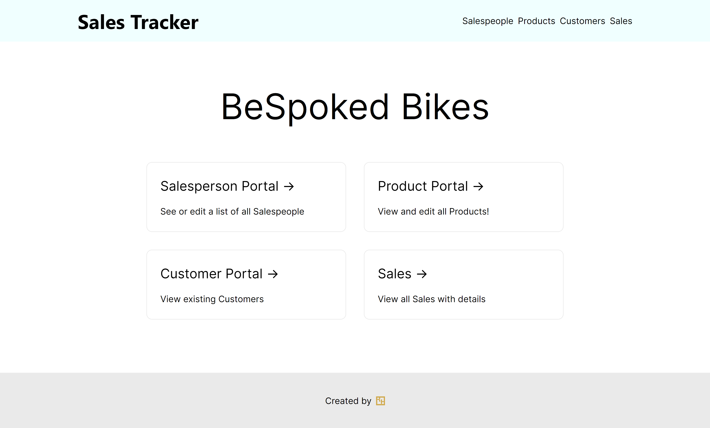

# Sales Tracker App

## Getting Started

This project is built with .NET 5, Entity Framework Core, SQL Server in the backend and Next.js in the frontend.

### Prerequisites

#### Backend

.NET 5, Microsoft.EntityFrameworkCore, Microsoft.EntityFrameworkCore.Tools

#### Frontend

Node v14.15.3, npm v6.14.9, nextjs v10.0.3, React v17.0.1

### Running the project

If you are running the project for the first time.

First, cd into `backend`. Configure the `connectionString` in `backend/appsettings.Development.json`. Then run the migrations using `dotnet-ef`. Migration should also Seed data to the Database. Then run `dotnet run`. It should open up on `http://localhost:5000`

Then, cd into `frontend` and do `npm install`. After all the dependencies are downloaded run `npm run dev` and It should open up on `http://localhost:3000`

### Contact

Riadul Hoque - [@hoqriad](https://twitter/hoqriad) - [hoqueriadul@gmail.com](mailto:hoqueriadul@gmail.com)

Project Link: https://github.com/Riadhoq/sales-tracking
